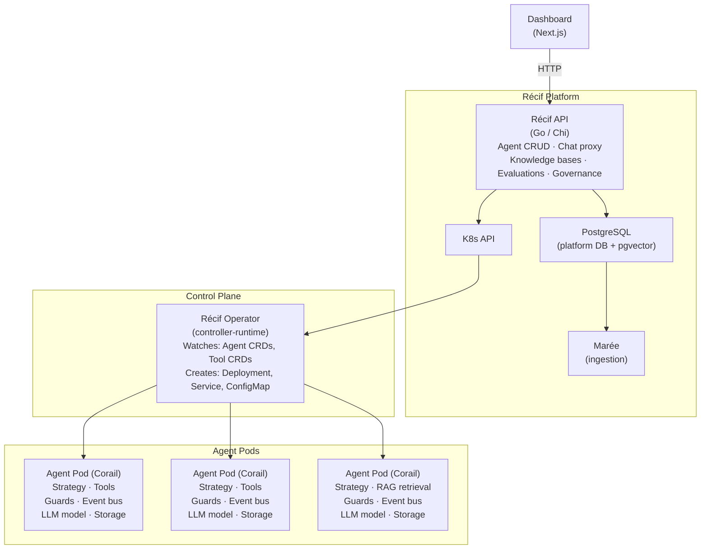
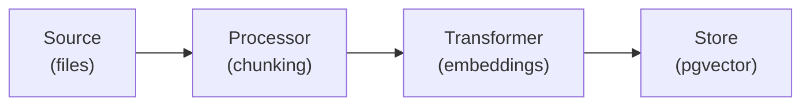
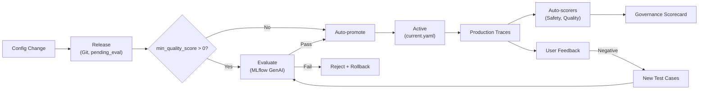

# Architecture Overview

Récif is a two-layer platform where each AI agent runs as an isolated Kubernetes Pod.

## System diagram

## Communication flow

1. **User** opens the Dashboard or calls the Récif API directly.
2. **Récif API** handles agent CRUD (stored in PostgreSQL) and proxies chat requests to the correct agent Pod.
3. **Chat proxy** resolves the agent slug to an in-cluster DNS name: `http://{agent-slug}.{namespace}.svc.cluster.local:8000`.
4. **Agent Pod** (Corail) receives the request, runs it through the pipeline (channel -> strategy -> model), and streams the response back as SSE.

## Corail runtime

Corail is the autonomous Python runtime that powers each agent. Its architecture is fully pluggable via the registry pattern:

- **Channels** -- How the agent receives input (REST API, WebSocket, CLI). Currently: `rest`.
- **Strategies** -- How the agent processes a request. The unified `agent-react` strategy adapts automatically: plain chat, ReAct tool loop (native or prompt-based), RAG retrieval, planning, memory — one strategy, all capabilities.
- **Models** -- The LLM backend (stub, ollama, openai, anthropic, vertex-ai, google-ai, bedrock). Each registered with a default model ID.
- **Tools** -- External actions the agent can take (HTTP APIs, CLI commands). Declared as Tool CRDs and resolved by the operator.
- **Guards** -- Input/output security: prompt injection detection, PII masking, secret blocking. Chained via `GuardPipeline`.
- **Events** -- In-process `EventBus` for runtime observability. All components emit typed events (tool calls, guard checks, budget usage).
- **Retrieval** -- Vector search via `PgVectorRetriever` + `MultiRetriever` for multi-KB RAG. Uses pluggable `EmbeddingProvider`.
- **Storage** -- Conversation persistence (memory, postgresql). Pluggable via `StoragePort` interface.
- **Adapters** -- Framework adapters (ADK) and LLM adapters for the pipeline. Central `AdapterRegistry` resolves by name.

All components use `importlib` lazy loading: modules are only imported when first used. New backends are added by calling `register_*()` with a module path and class name.

## Maree ingestion pipeline

Maree is a standalone document ingestion product that feeds the RAG pipeline. It runs as a CLI tool or is triggered by the Recif API when documents are uploaded.

Each stage is pluggable via the registry pattern. Maree writes enriched chunks to the same PostgreSQL database that Corail's `PgVectorRetriever` reads from, closing the ingestion-to-retrieval loop.

## Event-driven architecture

Inside each agent Pod, the `EventBus` provides a lightweight pub/sub mechanism. Strategies, guards, and tools emit events at key lifecycle points. Subscribers can:

- Log audit trails
- Collect metrics
- Trigger side effects (e.g., alert on `GUARD_BLOCKED`)
- Track budget consumption

The event bus is in-process only (not distributed). Each Pod has its own bus instance.

## Control plane flow

The Recif API and operator form the control plane:

1. **Dashboard/CLI** sends agent configuration to the Recif API
2. **Recif API** stores agent metadata in PostgreSQL and (for config changes) patches the Agent CRD in Kubernetes
3. **Operator** reconciles the CRD: resolves Tool CRDs, builds `CORAIL_*` env vars, creates/updates the ConfigMap, Deployment, and Service
4. **Config hash** annotation on the Pod template ensures the agent Pod restarts when configuration changes
5. **Agent Pod** (Corail) reads env vars at startup, initializes strategy with tools/guards/retrievers, and serves requests

## Récif operator

The operator is built with [Kubebuilder](https://kubebuilder.io/) and [controller-runtime](https://github.com/kubernetes-sigs/controller-runtime). It:

1. Watches `Agent` custom resources in any namespace.
2. Reconciles each Agent into three child resources (all with `ownerReferences` for automatic garbage collection):
   - **ConfigMap** -- Contains all `CORAIL_*` env vars derived from the Agent spec.
   - **Deployment** -- Runs the Corail container image with `envFrom` referencing the ConfigMap. Includes liveness (`/healthz`) and readiness probes.
   - **Service** -- ClusterIP on port 8000, enabling in-cluster DNS routing.
3. Updates the Agent status with `phase`, `replicas`, and `endpoint`.

## Multi-tenancy

- **Namespace-per-team**: Each team gets its own namespace (e.g., `team-default`). Agents are deployed into their team's namespace.
- **Istio mTLS**: All inter-service communication is encrypted. Istio authorization policies restrict cross-namespace traffic.
- **Network policies**: Helm templates include `NetworkPolicy` resources to limit pod-to-pod communication.

## Evaluation-driven lifecycle

Recif integrates MLflow GenAI as the evaluation backbone for the agent lifecycle:

Key components:

- **MLflow GenAI evaluate**: 14 LLM-judge scorers (safety, correctness, relevance, RAG groundedness, tool correctness, etc.)
- **Risk profiles**: `low`, `standard`, `high` — determine which scorers run per agent
- **Eval gate**: blocks deployment until score >= `min_quality_score` (0 = no gate, backward compatible)
- **Auto-scorers**: production traces sampled and scored continuously
- **Feedback loop**: negative user feedback becomes new evaluation test cases
- **Governance scorecard**: real quality/safety/cost/compliance data from MLflow

See [Evaluation-Driven Agent Lifecycle](/docs/recif/evaluation) for full details.

## Observability

The Helm chart configures:

- **Prometheus** metrics backend
- **Jaeger** tracing backend
- **Kiali** service mesh dashboard (included in Istio demo profile)
- **MLflow**: tracing, evaluation, feedback, prompt registry (deployed in `mlflow-system` namespace)
