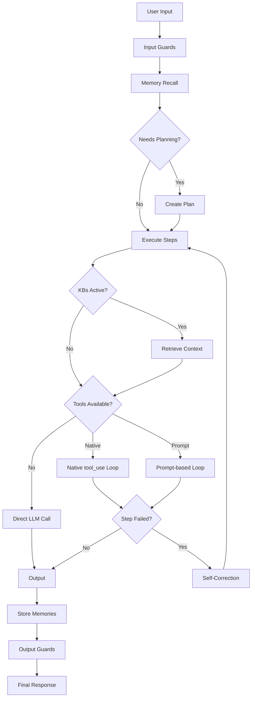

# Strategies

A **Strategy** defines the core execution loop of an agent -- HOW it reasons and acts. Different strategies exist because there are fundamentally different approaches to agent intelligence.

## Why Strategies Exist

Not all agents think the same way. A customer support bot, a code generator, and a CLI automation agent each need a different reasoning loop. Strategies are the abstraction that captures this difference.

| Strategy | Loop | Best for |
|----------|------|----------|
| `agent-react` (default) | Plan -> Think -> Act -> Observe -> Remember | General purpose, production |
| `codeact` (future) | Generate code -> Execute -> Observe | Code generation agents |
| `openclaw` (future) | CLI skills -> tool_use loop | CLI-native automation |

The `agent-react` strategy is the default and recommended choice. It dynamically adapts its behavior based on what is available:

- **No tools, no KB** -> simple chat (replaces the old `simple`)
- **Tools available** -> ReAct loop (replaces the old `react` and `react_v2`)
- **Knowledge bases active** -> RAG retrieval (replaces the old `rag`)
- **Complex task** -> Planning + multi-step execution
- **Between sessions** -> Persistent memory

One strategy, all capabilities. No more choosing between `simple`, `react`, `react_v2`, and `rag`.

## The `agent-react` Strategy

### Architecture



### Capabilities

#### 1. Planning

The Planner decomposes complex tasks into executable steps. When a user request is too broad for a single LLM call, the agent creates a plan, then executes each step sequentially. Progress is streamed to the UI in real time via SSE events.

Simple questions ("What time is it?") skip planning entirely. The agent decides autonomously.

#### 2. Tool Calling

Two modes, selected automatically based on the model:

- **Native** (Anthropic, Vertex AI Gemini, Bedrock, OpenAI) -- structured
  function-calling API with typed parameters and responses. The model sees
  tool schemas as first-class objects instead of text instructions.
- **Prompt-based** (Ollama, local models) -- `tool_call` blocks in the
  LLM output text, parsed by the strategy with a regex.

The agent auto-detects which mode to use based on `model.supports_tool_use`. During streaming, every tool invocation emits structured events:

- `ToolStartEvent` -- tool execution begins
- `ToolEndEvent` -- tool execution completed (with output and success flag)
- `ConfirmEvent` -- tool has `risk_level: confirm`, awaiting human approval
- `ComponentEvent` -- tool returned rich render hints (table, chart, etc.)

Unexpected exceptions raised by a tool are caught inside
`_execute_tool_with_retry_full` and surfaced to the LLM as a
`tool_result` message containing `Error: <type>: <message>` so the
model can retry or explain, instead of bubbling up and ending the
session mid-turn (the "pi-agent" pattern).

#### 2b. Grounding and action rules

Every agent system prompt is prepended with two strict rule blocks
(unless the strategy is constructed with `grounding_strict=False`):

- **Grounding rules** — every factual claim must be traceable to a
  tool result; never invent dates, numbers, prices, quotes, or source
  names; if a tool returned only titles and URLs say so explicitly
  instead of guessing. This addresses the original hallucination
  trace (`tr-06b1992a`) where a model invented a stock price and
  cited a source that was not in the `web_search` output.
- **Action rules** — if the model decides to call a tool it must emit
  the tool call immediately, never write "I will search for X" or
  "Je vais essayer Y" as text; if a `fetch_url` call fails (403,
  timeout, consent wall) retry with a different URL in the SAME turn;
  the final message must describe what the agent actually did, not
  what it plans to do next.

The rules are defined once in `corail/strategies/_shared.py` and
shared across every strategy variant that uses `build_system_prompt`.

#### 3. RAG Retrieval

When knowledge bases are active, the agent searches for relevant context before answering. Supports multiple knowledge bases searched in parallel via `MultiRetriever`, with results merged by score.

Per-request controls:

| Option | Default | Description |
|--------|---------|-------------|
| `use_rag` | `true` | Disable retrieval for this request |
| `active_kbs` | all | Only search specific KBs |
| `min_score` | `0.3` | Minimum relevance threshold |

Source attribution is included automatically -- the agent yields source filenames before the LLM response.

#### 4. Guards

Input/output security pipeline. Guards run before and after LLM calls to enforce safety policies:

- **Prompt injection detection** -- blocks adversarial inputs
- **PII masking** -- redacts personal information
- **Secret detection** -- prevents credential leaks

Guards are pluggable via the registry. Configure them through `CORAIL_GUARDS`:

```bash
CORAIL_GUARDS='["prompt_injection", "pii", "secrets"]'
```

If any guard blocks, the strategy returns `[Blocked] reason` instead of calling the LLM.

#### 5. Memory

Persistent across sessions. The agent remembers facts, preferences, and observations from previous conversations. Memory is recalled at the start of each request and stored at the end.

Memory is a versioned artifact -- it can be inherited and merged across agents.

#### 6. Self-Correction

When a step fails (tool error, bad output, timeout), the agent asks itself for an alternative approach and retries. This happens transparently within the execution loop, up to the budget limit.

#### 7. Budget and deterministic stop reasons

Configurable execution constraints that prevent runaway loops:

```python
BudgetOptions(
    max_rounds=10,    # Maximum tool-calling rounds (default: 10)
    max_tokens=100000 # Approximate token budget (default: 100,000)
)
```

Every loop termination carries an explicit `StopReason` (emitted on
the final `TURN_ENDED` event so frontends and MLflow traces can show
*why* a response ended instead of silently truncating):

| Reason | Meaning |
|--------|---------|
| `end_turn` | LLM produced a final answer with no tool calls |
| `max_rounds` | Reached `max_rounds` without converging — response is suffixed with `[Stopped: max rounds reached]` |
| `token_budget` | Accumulated output exceeded `max_tokens` — response suffixed with `[Stopped: token budget exceeded]` |
| `tool_error` | A tool error the loop could not recover from |
| `guard_blocked` | An input/output guard rejected the content |
| `user_aborted` | The client cancelled the stream |

#### 8. Events

Every step emits events to the `EventBus` for observability, audit, and the Recif control plane. Event types include:

- `TURN_STARTED` / `TURN_ENDED` (one pair per reasoning round; the final `TURN_ENDED` carries the `StopReason`)
- `LLM_CALL_STARTED` / `LLM_CALL_COMPLETED`
- `TOOL_CALLED` / `TOOL_RESULT` / `TOOL_ERROR`
- `GUARD_BLOCKED`
- `BUDGET_EXCEEDED`
- `PLAN_CREATED` / `PLAN_STEP_STARTED` / `PLAN_STEP_COMPLETED` / `PLAN_STEP_FAILED` / `PLAN_COMPLETED`
- `MEMORY_RECALLED` / `MEMORY_STORED`

Subscribe handlers for logging, metrics, or real-time dashboards. The
MLflow tracing listener consumes `TOOL_CALLED` / `TOOL_RESULT` events to
build `tool:<name>` child spans inside the request trace automatically.

### Configuration

```yaml
apiVersion: agents.recif.dev/v1
kind: Agent
metadata:
  name: my-agent
spec:
  strategy: agent-react    # The unified strategy
  modelType: vertex-ai
  modelId: gemini-2.5-flash
  tools:
    - calculator
    - web_search
    - fetch_url
    - kubectl
  knowledgeBases:
    - company-docs
  systemPrompt: "You are a helpful assistant."
```

## Custom Strategies

Strategies exist for fundamentally different loop engines -- not for feature flags. If you need a completely different reasoning loop (not just different tools or KBs), create a custom strategy.

Examples of when a custom strategy makes sense:

- **`codeact`** -- instead of calling tools, generates and executes code directly
- **Framework wrappers** (OpenClaw, LangChain) -- different agent architectures with their own execution models

### Implementing a custom strategy

1. Implement `AgentStrategy`:

```python
from corail.strategies.base import AgentStrategy

class MyStrategy(AgentStrategy):
    async def execute(self, user_input, history=None):
        ...
    async def execute_stream(self, user_input, history=None):
        ...
```

2. Register it:

```python
from corail.strategies.factory import register_strategy

register_strategy("my_custom", "my_module", "MyStrategy")
```

3. Set `strategy: my_custom` in the Agent CRD or `CORAIL_STRATEGY=my_custom` env var.

Strategy variants can reuse the shared helpers in
`corail/strategies/_shared.py` — `_EventEmitter`, `_GuardRunner`,
`StopReason`, and `build_system_prompt` (which layers the user prompt,
grounding rules, memory context, and skill directives into one string).

### Strategy initializers

Each strategy can register an **initializer** -- a function that builds the extra `kwargs` needed by the strategy constructor from the `Settings` object. This keeps the CLI and FastAPI entry points free of strategy-specific logic.

```python
from corail.strategies.initializers import register_initializer, build_strategy_kwargs

@register_initializer("my_custom")
def _init_my_custom(settings):
    return {"custom_param": build_something(settings)}

# At startup:
kwargs = build_strategy_kwargs(settings)
strategy = StrategyFactory.create(settings.strategy, model=model, **kwargs)
```

## Strategy factory

All strategies are resolved via `StrategyFactory`:

```python
from corail.strategies.factory import StrategyFactory

strategy = StrategyFactory.create(
    "agent-react",
    model=model,
    system_prompt="You are an SRE assistant.",
    tools=registry,
    guard_pipeline=pipeline,
    event_bus=bus,
    max_rounds=5,
    max_tokens=100_000,
    grounding_strict=True,   # Inject grounding + action rules (default)
)

# List available strategies
print(StrategyFactory.available())  # ['agent-react']
```
