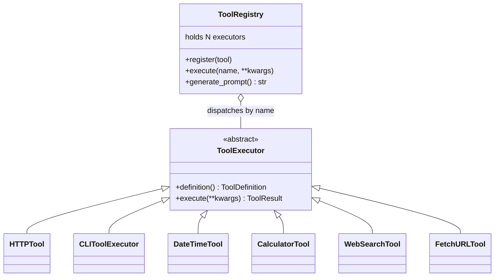

# Tools

Corail agents can call external tools during reasoning via the ReAct strategy. The tool system is fully pluggable -- every tool implements a single interface, and a registry connects tools to the agent at runtime.

## Architecture



### ToolExecutor interface

Every tool implements two methods:

```python
from corail.tools.base import ToolExecutor, ToolDefinition, ToolResult

class MyTool(ToolExecutor):
    def definition(self) -> ToolDefinition:
        """Schema the LLM sees to decide when to call this tool."""
        ...

    async def execute(self, **kwargs) -> ToolResult:
        """Run the tool. Returns success/failure + output."""
        ...
```

`ToolDefinition` describes the tool's name, description, and typed parameters. The registry injects this into the system prompt so the LLM knows what tools are available.

`ToolResult` carries `success: bool`, `output: str`, and optional `error: str`.

### ToolRegistry

Holds all tools available to an agent. Used by `ReActStrategy` to dispatch tool calls.

```python
from corail.tools.registry import ToolRegistry
from corail.tools.builtins import CalculatorTool, DateTimeTool

registry = ToolRegistry()
registry.register(CalculatorTool())
registry.register(DateTimeTool())

# Execute by name
result = await registry.execute("calculator", expression="15 * 37")
```

## Available tool types

### Built-in tools

| Tool | Name | Description |
|------|------|-------------|
| `DateTimeTool` | `datetime` | Current UTC date/time |
| `CalculatorTool` | `calculator` | Safe math expression evaluation |
| `WebSearchTool` | `web_search` | Search the web — returns titles, URLs, and snippets (no page download) |
| `FetchURLTool` | `fetch_url` | Download one URL and return its readable text content (HTML stripped) |

### Search → fetch flow

`web_search` and `fetch_url` are deliberately separate. The agent first calls
`web_search` to discover candidate URLs, decides which result looks most
promising from the titles and snippets, then calls `fetch_url` on that URL
to actually read the page. Each call produces its own MLflow span
(`tool:web_search` and `tool:fetch_url`), which makes it possible to tell at
a glance whether a failure came from the search step or from a specific
page download — and lets evaluators score the agent's URL-selection
decision independently of its query wording.

#### web_search backends

Selected via the `CORAIL_SEARCH_BACKEND` env var:

| Backend | Value | Notes |
|---------|-------|-------|
| DuckDuckGo | `ddgs` (default) | Free, no API key, via the `ddgs` library |
| SearXNG | `searxng` | Self-hosted instance, set `CORAIL_SEARXNG_URL` |

#### fetch_url behaviour

- Sends a real Chrome User-Agent plus `Accept` / `Accept-Language` headers.
  The previous `CorailAgent/1.0` UA was trivially rejected by Cloudflare on
  most finance and news sites.
- Follows redirects, then explicitly fails if the final host matches a
  consent/login wall pattern (`consent.*`, `accounts.*`, `auth.*`,
  `login.*`, `idp.*`, `signin.*`) — otherwise Google Finance and
  Yahoo Finance would return 200 OK but with a cookie-consent page.
  Explicit failure lets the agent's retry rules kick in on another URL.
- Uses a shared `httpx.AsyncClient` with keep-alive, so a chain of
  fallback fetches in the same turn reuses the connection pool instead
  of paying a TLS handshake per call.
- Extracts readable text with a stdlib `html.parser` — no
  trafilatura/lxml/beautifulsoup dependency. Stops collecting once it
  has roughly 3× the caller's `max_chars` of raw text, so a pathological
  10 MB page can't OOM the worker.
- Returns the extracted text under a header line showing the final URL,
  HTTP status, and content-type so the LLM can cite the exact source.

Sites behind enterprise Cloudflare (Investing.com, Bloomberg, Reuters)
still return 403 — nothing short of a headless browser can bypass that.
The agent handles this gracefully by retrying with a different result URL.

### HTTP tool

Calls external REST APIs. Supports GET/POST/PUT/DELETE with headers, path params, and JSON bodies.

```python
from corail.tools.http_tool import HTTPTool
from corail.tools.base import ToolParameter

weather = HTTPTool(
    name="weather",
    description="Get current weather for a city",
    url="https://api.weather.com/v1/{city}",
    method="GET",
    headers={"Authorization": "Bearer $KEY"},
    parameters=[
        ToolParameter(name="city", type="string", description="City name"),
    ],
)
```

### CLI tool

Runs local CLI commands via `asyncio.create_subprocess_exec`. Never uses `shell=True`.

```python
from corail.tools.cli_tool import CLIToolExecutor
from corail.tools.base import ToolParameter

kubectl = CLIToolExecutor(
    name="kubectl",
    description="Query Kubernetes resources",
    binary="kubectl",
    parameters=[
        ToolParameter(name="command", type="string", description="Subcommand: get, describe, logs"),
        ToolParameter(name="namespace", type="string", description="K8s namespace", required=False),
    ],
    allowed_commands=["get", "describe", "logs"],  # whitelist
    timeout=15.0,
)
```

Key features:

- **Subcommand whitelist** -- `allowed_commands` restricts which subcommands are permitted
- **Argument mapping** -- `key=value` becomes `--key value`, `key=True` becomes `--key`
- **Security** -- shell metacharacters (`;`, `|`, `` ` ``, `$`, `()`, `{}`) are stripped from all values
- **Timeout** -- defaults to 30s, configurable per tool
- **Output truncation** -- stdout capped at 4000 chars (success) or 2000 chars (error) to fit LLM context

## ToolFactory

Resolve tools by type string via the registry pattern:

```python
from corail.tools.factory import ToolFactory

tool = ToolFactory.create("cli", name="git", description="Git", binary="git")
tool = ToolFactory.create("calculator")
```

Available types: `http`, `cli`, `datetime`, `calculator`, `web_search`, `fetch_url`.

Register custom types at runtime:

```python
from corail.tools.factory import register_tool

register_tool("my_tool", "mypackage.tools", "MyCustomTool")
```

## Risk levels and render hints

Each tool declares a `risk_level` and can return structured render hints:

```python
ToolDefinition(
    name="kubectl_delete",
    description="Delete a Kubernetes resource",
    risk_level="confirm",    # safe (default), confirm, or blocked
    parameters=[...],
)
```

| Risk level | Behavior |
|------------|----------|
| `safe` | Execute immediately |
| `confirm` | Emit a `ConfirmEvent`, wait for human approval |
| `blocked` | Never execute |

Tools can also return render hints to control how the dashboard displays results:

```python
ToolResult(
    success=True,
    output='{"columns": [...], "rows": [...]}',
    render="table",     # text, table, chart, json, code, react
    component="",       # React component name (when render="react")
    props={},           # Props for the component
)
```

See [AG-UI](/docs/corail/agui) for details on how render hints are consumed by the frontend.

## Tool CRD (Kubernetes)

Tools can be declared as Kubernetes custom resources and assigned to agents:

```yaml
apiVersion: agents.recif.dev/v1
kind: Tool
metadata:
  name: weather-api
  namespace: team-default
spec:
  name: weather
  type: http
  category: general
  description: "Get current weather for a city"
  endpoint: "https://api.weather.com/v1/{city}"
  method: GET
  headers:
    Authorization: "Bearer $KEY"
  parameters:
    - name: city
      type: string
      description: "City name"
      required: true
  timeout: 30
  enabled: true
```

Supported `type` values: `http`, `cli`, `mcp`, `builtin`.

### Assigning tools to agents

Reference Tool CRD names in the Agent CRD:

```yaml
apiVersion: agents.recif.dev/v1
kind: Agent
metadata:
  name: sre-agent
  namespace: team-default
spec:
  name: "SRE Agent"
  framework: adk
  strategy: agent-react
  modelType: anthropic
  modelId: claude-sonnet-4-20250514
  tools:
    - weather-api
    - kubectl-reader
```

The operator resolves each Tool CRD by name, serializes them as JSON, and injects the result as the `CORAIL_TOOLS` environment variable in the agent's ConfigMap. Corail's strategy initializer parses this JSON and builds a `ToolRegistry` at startup.

## Agent strategy integration

The `agent-react` strategy accepts a `ToolRegistry` and exposes tools to the
LLM via whichever tool-calling path the underlying model supports:

- **Native function calling** — Anthropic, Vertex AI (Gemini), Bedrock,
  OpenAI. The model sees tool schemas as first-class objects.
- **Prompt-based** — Ollama and other providers without native support.
  Tool definitions are injected into the system prompt and parsed from
  the response text.

In both paths, unexpected exceptions raised by a tool are caught and
surfaced to the LLM as a `tool_result` containing `Error: <message>` so the
model can retry or explain — exceptions never bubble up and kill the turn.

```python
from corail.models.factory import ModelFactory
from corail.strategies.factory import StrategyFactory
from corail.tools.registry import ToolRegistry
from corail.tools.factory import ToolFactory
from corail.tools.cli_tool import CLIToolExecutor
from corail.tools.base import ToolParameter

# 1. Build tools
registry = ToolRegistry()
registry.register(ToolFactory.create("builtin", name="datetime"))
registry.register(ToolFactory.create("builtin", name="calculator"))
registry.register(ToolFactory.create("builtin", name="web_search"))
registry.register(ToolFactory.create("builtin", name="fetch_url"))
registry.register(CLIToolExecutor(
    name="kubectl",
    description="Query Kubernetes cluster",
    binary="kubectl",
    allowed_commands=["get", "describe"],
    parameters=[
        ToolParameter(name="command", type="string", description="Subcommand"),
        ToolParameter(name="resource", type="string", description="Resource type"),
    ],
))

# 2. Create model + strategy
model = ModelFactory.create("vertex-ai", "gemini-2.5-flash")
strategy = StrategyFactory.create(
    "agent-react",
    model=model,
    system_prompt="You are an SRE assistant.",
    tools=registry,
)

# 3. The agent can now reason, call tools, and use results
```

## Creating a custom tool

Implement `ToolExecutor` and register it:

```python
from corail.tools.base import ToolDefinition, ToolExecutor, ToolParameter, ToolResult

class SlackNotifyTool(ToolExecutor):
    def __init__(self, webhook_url: str) -> None:
        self._webhook_url = webhook_url

    def definition(self) -> ToolDefinition:
        return ToolDefinition(
            name="slack_notify",
            description="Send a message to a Slack channel",
            parameters=[
                ToolParameter(name="message", type="string", description="Message text"),
                ToolParameter(name="channel", type="string", description="Channel name"),
            ],
        )

    async def execute(self, **kwargs) -> ToolResult:
        import httpx
        message = str(kwargs.get("message", ""))
        channel = str(kwargs.get("channel", "#general"))
        try:
            async with httpx.AsyncClient() as client:
                resp = await client.post(self._webhook_url, json={
                    "channel": channel, "text": message,
                })
                resp.raise_for_status()
            return ToolResult(success=True, output=f"Sent to {channel}")
        except Exception as e:
            return ToolResult(success=False, output="", error=str(e))
```

Then register it in the factory for config-driven creation:

```python
from corail.tools.factory import register_tool

register_tool("slack", "mypackage.tools.slack", "SlackNotifyTool")
```
