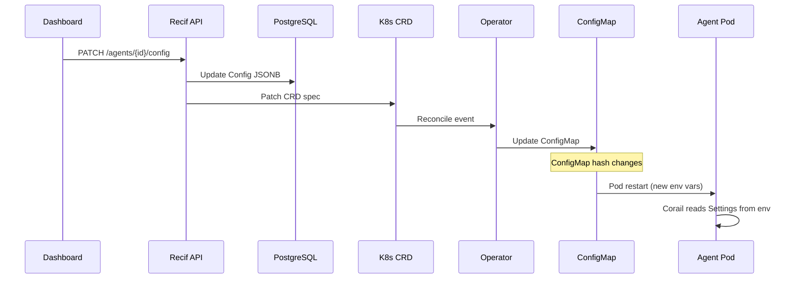

# Agent Settings

Every agent in Recif is configurable through the dashboard API. Settings flow from the API to the running agent automatically:

```
Dashboard / API  →  Database (JSONB)  →  K8s CRD  →  Operator  →  ConfigMap  →  Agent Pod
```

When you update a setting, the agent pod restarts with the new configuration within seconds.

## Core settings

These define what the agent is and how it runs.

| Setting | API key | Type | Default | Description |
|---------|---------|------|---------|-------------|
| Model provider | `model_type` | string | `ollama` | LLM backend: `ollama`, `openai`, `anthropic`, `vertex-ai`, `bedrock`, `google-ai` |
| Model ID | `model_id` | string | `qwen3.5:4b` | Model identifier (e.g. `gpt-4o`, `claude-sonnet-4-20250514`, `qwen3.5:35b`) |
| Background model | `background_model` | string | — | `provider:model_id` URI used for cheap background work (memory extraction, follow-up suggestions, auto-titles). See [Background model](#background-model). |
| System prompt | `system_prompt` | string | — | The agent's personality and instructions |
| Strategy | `strategy` | string | `agent-react` | Execution strategy: `simple`, `agent-react`, `rag` |
| Channel | `channel` | string | `rest` | Communication protocol: `rest`, `discord`. See [Channels](../corail/channels.md). |
| Storage | `storage` | string | auto | Conversation persistence: `memory` (ephemeral) or `postgresql` (persistent). When omitted, the operator picks `postgresql` if a `DATABASE_URL` is configured, otherwise `memory`. |
| Tools | `tools` | string[] | `[]` | Tool CRD names assigned to the agent |
| Skills | `skills` | string[] | `[]` | Skill IDs available to the agent |
| Knowledge bases | `knowledge_bases` | string[] | `[]` | KB IDs — each becomes a `search_{slug}` tool the agent calls on demand |
| Image | `image` | string | `corail:latest` | Container image for the agent runtime |

### Example: update core settings

```bash
curl -X PATCH http://localhost:8080/api/v1/agents/{id}/config \
  -H "Content-Type: application/json" \
  -d '{
    "modelType": "openai",
    "modelId": "gpt-4o",
    "systemPrompt": "You are a helpful assistant specialized in HR policies."
  }'
```

## Evaluation settings

These control the evaluation-driven lifecycle — quality gates, auto-scoring, and LLM judges.

| Setting | API key | Type | Default | Description |
|---------|---------|------|---------|-------------|
| Eval sample rate | `eval_sample_rate` | int (0-100) | `0` | Percentage of production traces to auto-evaluate. 0 = disabled. |
| Judge model | `judge_model` | string | `openai:/gpt-4o-mini` | Model used by LLM judges for evaluation scoring |

### How evaluation works

1. **Manual evaluation**: Trigger from the dashboard via `POST /agents/{id}/evaluations`
2. **Release gate**: Set `min_quality_score` in governance config to block deploys below a threshold
3. **Continuous monitoring**: Set `eval_sample_rate > 0` to auto-score production traces

### Example: enable continuous evaluation

```bash
curl -X PATCH http://localhost:8080/api/v1/agents/{id}/config \
  -H "Content-Type: application/json" \
  -d '{
    "evalSampleRate": 10,
    "judgeModel": "anthropic:/claude-haiku-4-5-20251001"
  }'
```

This evaluates 10% of production traces using Claude Haiku as the LLM judge.

## Suggestion settings

These control the follow-up suggestions that appear after each agent response.

| Setting | API key | Type | Default | Description |
|---------|---------|------|---------|-------------|
| Suggestions provider | `suggestions_provider` | string | `llm` | How suggestions are generated: `llm` (dynamic from model), `static` (from config) |
| Static suggestions | `suggestions` | string (JSON) | `""` | JSON array of static suggestions for empty chat state |

### Provider modes

- **`llm`** (default): After each response, the agent's model generates 2-3 follow-up questions. Uses low `max_tokens` (100) and high `temperature` (0.8) for variety.
- **`static`**: Returns a fixed list of suggestions from the `suggestions` field. Useful for onboarding prompts.

### Example: configure suggestions

```bash
# Dynamic suggestions (default)
curl -X PATCH http://localhost:8080/api/v1/agents/{id}/config \
  -H "Content-Type: application/json" \
  -d '{"suggestionsProvider": "llm"}'

# Static suggestions for onboarding
curl -X PATCH http://localhost:8080/api/v1/agents/{id}/config \
  -H "Content-Type: application/json" \
  -d '{
    "suggestionsProvider": "static",
    "suggestions": "[\"What can you do?\", \"Show me examples\", \"Help me with a task\"]"
  }'
```

## Background model

Corail runs several tasks **after** a chat response is delivered:

- **Memory extraction** — summarises the conversation into long-term memories
- **Follow-up suggestions** — generates 2-3 questions the user might ask next
- **Auto-generated conversation titles** — replaces the fallback title (first 60 chars of the user's message) with a short LLM-generated one

By default, these reuse the agent's main chat model. That is fine when the chat model is small or served in the cloud, but becomes painful with large local models: a 35B running on CPU/Metal can block follow-up suggestions for 30-120 seconds, and Ollama may have to reload the model for every background call.

The `backgroundModel` field lets you point background tasks at a **cheaper, faster model** while keeping a heavy one for chat. It accepts the same `provider:model_id` URI format (with or without a leading slash in the model id):

```bash
curl -X PATCH http://localhost:8080/api/v1/agents/{id}/config \
  -H "Content-Type: application/json" \
  -d '{"backgroundModel": "ollama:qwen3.5:4b"}'
```

Other examples:

| URI | Behaviour |
|-----|-----------|
| `ollama:qwen3.5:4b` | Local Ollama, 4B model (fast even on CPU) |
| `openai:/gpt-4o-mini` | OpenAI cloud, cheap and fast |
| `google-ai:gemini-2.5-flash` | Google AI Studio |
| *(empty)* | Reuses the main chat model (default) |

### Ollama model swapping

When your chat model and background model are **both Ollama** but **different sizes** (e.g. `qwen3.5:35b` + `qwen3.5:4b`), Ollama's default `keep_alive` of 5 minutes means the smaller model gets unloaded between turns, so the next suggestion call pays a full reload penalty.

Corail passes a longer `keep_alive` (30 min by default) on every request so Ollama holds both models in memory as long as the host has RAM. Tune via `CORAIL_OLLAMA_KEEP_ALIVE` on the agent pod:

```yaml
# Helm values override or agent env
CORAIL_OLLAMA_KEEP_ALIVE: "1h"    # hold models for 1 hour
CORAIL_OLLAMA_KEEP_ALIVE: "-1"    # hold indefinitely (careful with RAM)
```

You'll also want to bump Ollama's own `OLLAMA_MAX_LOADED_MODELS` (default `1`) to at least `2` so it can actually hold both.

### What happens if the background model fails

All background tasks are best-effort and bounded:

- **Suggestions** have a hard 15s deadline (`CORAIL_SUGGESTIONS_TIMEOUT`). If the background model takes longer, the SSE stream closes without suggestions — the user still sees the chat response.
- **Memory extraction** and **title upgrade** run fully detached from the SSE stream: the user never waits on them. Failures log a single line and are forgotten.
- If `backgroundModel` is unset, all three tasks fall back to the main chat model.

## Governance settings

These are set in the agent's governance config (inside the `config` JSONB) and control quality gates.

| Setting | Config key | Type | Default | Description |
|---------|-----------|------|---------|-------------|
| Min quality score | `governance.min_quality_score` | int (0-100) | `0` | Minimum eval score to deploy. 0 = no gate. |
| Risk profile | `governance.risk_profile` | string | `standard` | Scorer preset: `low`, `standard`, `high` |
| Eval dataset | `governance.eval_dataset` | string | `""` | Golden dataset name for release evaluation |
| Guards | `governance.guards` | string[] | `[]` | Active guardrails: `prompt-injection`, `pii`, `secret` |

### Risk profiles and their scorers

| Profile | Scorers |
|---------|---------|
| `low` | Safety, RelevanceToQuery |
| `standard` | Safety, RelevanceToQuery, Correctness |
| `high` | Safety, RelevanceToQuery, Correctness, Guidelines, RetrievalGroundedness, ToolCallCorrectness |

### Example: enable quality gate

```bash
curl -X PATCH http://localhost:8080/api/v1/agents/{id}/config \
  -H "Content-Type: application/json" \
  -d '{
    "config": {
      "governance": {
        "min_quality_score": 75,
        "risk_profile": "high",
        "eval_dataset": "golden-v2"
      }
    }
  }'
```

With this config, every release must score >= 75% on the `high` scorer suite before being promoted to active.

## Infrastructure settings

These are typically set at the cluster level (Helm values) and not per-agent.

| Env var | Default | Description |
|---------|---------|-------------|
| `MLFLOW_TRACKING_URI` | `http://mlflow.mlflow-system.svc.cluster.local:5000` | MLflow server for tracing and evaluation |
| `DATABASE_URL` | (from Helm) | PostgreSQL connection for conversation persistence |
| `OLLAMA_BASE_URL` | (from Helm) | Ollama API endpoint. Set via `ollama.baseUrl` in the Helm chart (e.g. `http://host.docker.internal:11434` on colima/docker-desktop). |
| `CORAIL_BACKGROUND_MODEL` | — | Fallback override for the per-agent `backgroundModel` field. Useful when set cluster-wide (e.g. all agents use `openai:/gpt-4o-mini` for background work). |
| `CORAIL_OLLAMA_KEEP_ALIVE` | `30m` | How long Ollama holds each model loaded after a request. Longer values avoid reload latency when chat + background use different models. |
| `CORAIL_OLLAMA_TIMEOUT` | `300` | HTTP timeout (seconds) for Ollama requests. Bump when running large local models on slow hardware. |
| `CORAIL_SUGGESTIONS_TIMEOUT` | `15` | Hard deadline (seconds) for follow-up suggestion generation. The SSE stream closes at this point regardless, so proxies don't drop the connection with `ERR_INCOMPLETE_CHUNKED_ENCODING`. |

## How settings propagate



Changes take effect within seconds. The agent pod restarts automatically when the ConfigMap hash changes.
