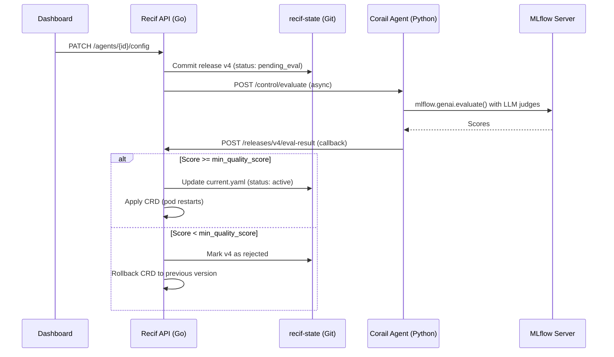

# Evaluation-Driven Agent Lifecycle

Recif uses evaluation as the decision engine for the entire agent lifecycle. Every deployment is gated by real quality scores, continuous monitoring runs on production traces, and negative feedback automatically strengthens the evaluation dataset.

## Architecture



## How it works

### 1. Release creation

When an agent config changes, a new release artifact is committed to the `recif-state` Git repository with `status: pending_eval`.

### 2. Evaluation gate

If the agent's governance config has `min_quality_score > 0`, Recif triggers an async evaluation on the Corail agent's control plane:

```
POST http://{agent-slug}:8001/control/evaluate
```

The evaluation uses MLflow GenAI's `evaluate()` function with real LLM judges. Scorers are selected based on the agent's `risk_profile`:

| Risk Profile | Scorers |
|-------------|---------|
| `low` | Safety, RelevanceToQuery |
| `standard` | Safety, RelevanceToQuery, Correctness |
| `high` | Safety, RelevanceToQuery, Correctness, Guidelines, RetrievalGroundedness, ToolCallCorrectness |

### 3. Approval or rejection

When evaluation completes, Corail POSTs the results to:

```
POST /api/v1/agents/{id}/releases/{version}/eval-result
```

- **Score >= threshold**: release promoted to `active`, `current.yaml` updated, CRD applied.
- **Score < threshold**: release marked `rejected`, CRD rolled back to previous version.

### 4. Backward compatibility

If `min_quality_score == 0` (the default), releases auto-promote immediately with no evaluation gate. Existing agents keep working without configuration changes.

## Configuration

Set governance parameters in the agent's config JSONB:

```json
{
  "governance": {
    "min_quality_score": 75,
    "risk_profile": "standard",
    "eval_dataset": "golden-v2.jsonl",
    "guards": ["prompt-injection", "pii"]
  }
}
```

| Field | Type | Default | Description |
|-------|------|---------|-------------|
| `min_quality_score` | int (0-100) | 0 | Minimum average score to pass. 0 = no gate. |
| `risk_profile` | string | "standard" | Scorer preset: `low`, `standard`, `high`. |
| `eval_dataset` | string | "" | Name of the golden dataset to evaluate against. |
| `guards` | []string | [] | Active guardrails (prompt-injection, pii, secret). |

## Available scorers

14 scorers from MLflow GenAI, resolved via registry pattern:

**Response quality:** `safety`, `relevance_to_query`, `correctness`, `completeness`, `fluency`, `equivalence`, `summarization`, `guidelines`, `expectations_guidelines`

**RAG:** `retrieval_relevance`, `retrieval_groundedness`, `retrieval_sufficiency`

**Tool calls:** `tool_call_correctness`, `tool_call_efficiency`

Custom scorers can be registered:

```python
from corail.evaluation.mlflow_evaluator import register_scorer
register_scorer("my_scorer", "my_module", "MyScorerClass")
```

## Continuous evaluation

Set `RECIF_EVAL_SAMPLE_RATE` on the Corail agent to enable production auto-scoring:

```yaml
env:
  - name: RECIF_EVAL_SAMPLE_RATE
    value: "0.1"  # Score 10% of production traces
  - name: RECIF_JUDGE_MODEL
    value: "anthropic:/claude-haiku-4-5-20251001"
```

## Feedback loop

User and expert feedback is collected via `POST /api/v1/feedback` and proxied to MLflow as trace assessments. Negative feedback (rating < 3) is flagged for inclusion in the agent's evaluation dataset, creating a self-improving quality loop:

```
Production failure → Negative feedback → New test case → Next version must pass
```

## Governance scorecard

The governance scorecard at `GET /api/v1/governance/scorecards/{agent_id}` pulls real data from MLflow when available:

- **Quality**: latest eval run scores (correctness, relevance)
- **Safety**: auto-scorer results from production traces
- **Cost**: trace token usage and latency metrics
- **Compliance**: policy violation counts

Falls back to estimated scores when MLflow is unavailable.

## Canary quality gate

Flagger can query Recif's quality gate webhook during canary analysis:

```yaml
# Flagger Canary spec
webhooks:
  - name: quality-gate
    type: confirm-rollout
    url: http://recif:8080/api/v1/webhooks/flagger
```
